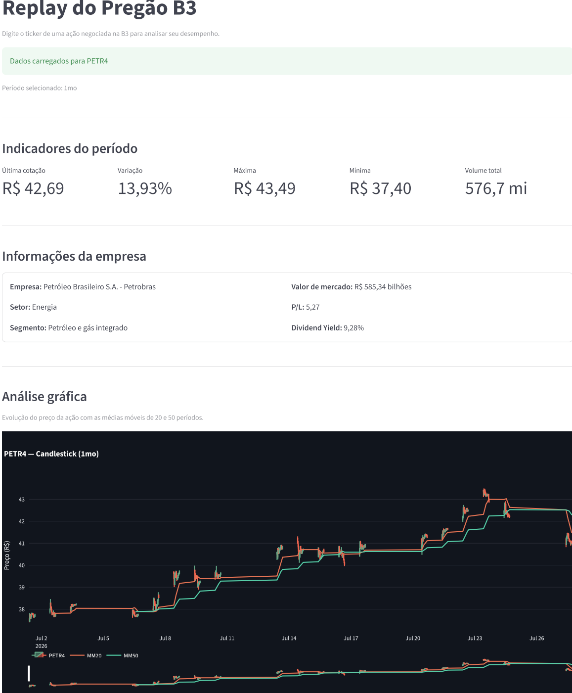
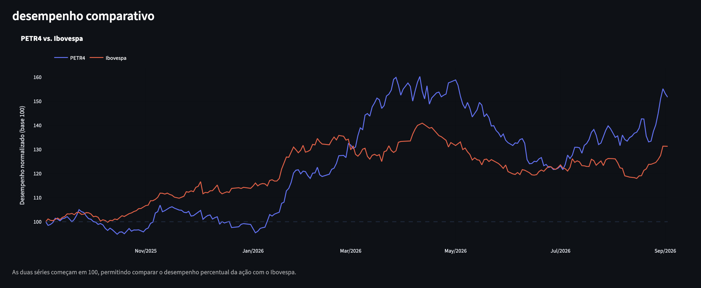
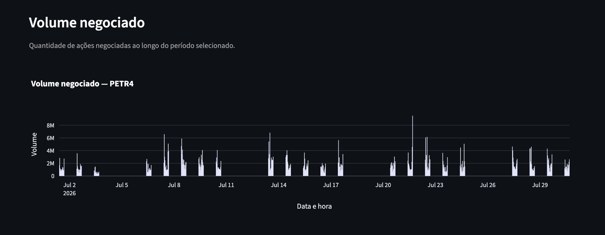

# Replay do Pregão B3

Dashboard interativo desenvolvido em Python para análise de ações negociadas na B3.

O projeto permite consultar dados históricos de ações brasileiras, visualizar indicadores de desempenho, analisar gráficos financeiros e comparar o desempenho do ativo com o Ibovespa.

## Dashboard



## Comparação com o Ibovespa



## Volume negociado




## Sobre o projeto

O Replay do Pregão B3 é um projeto pessoal desenvolvido para aplicar conhecimentos de Python, análise de dados e visualização de informações no contexto do mercado financeiro.

A aplicação utiliza dados do Yahoo Finance e apresenta as informações em um dashboard desenvolvido com Streamlit. O usuário pode informar o ticker de uma ação negociada na B3, selecionar o período desejado e visualizar indicadores, gráficos e informações da empresa.

O objetivo do projeto é facilitar a análise de ativos por meio de uma interface simples, organizada e interativa.


## Funcionalidades

- Consulta de ações negociadas na B3
- Seleção do período de análise
- Exibição da última cotação
- Cálculo da variação percentual
- Identificação do preço máximo e mínimo
- Cálculo do volume negociado
- Exibição de informações da empresa
- Cálculo das médias móveis de 20 e 50 períodos
- Gráfico de candlestick
- Gráfico de volume
- Comparação de desempenho com o Ibovespa
- Visualização dos dados históricos
- Download dos dados em formato CSV


## Tecnologias utilizadas

- Python
- Streamlit
- Pandas
- NumPy
- Plotly
- yfinance


## Estrutura do projeto

```text
Replay-Pregao-B3/
│
├── dados/
│   └── replay_pregao_b3.csv
│
├── imagens/
│   ├── dashboard.png
│   ├── comparacao.png
│   └── volume.png
│
├── notebooks/
│
├── src/
│   ├── app.py
│   ├── config.py
│   ├── dados.py
│   ├── graficos.py
│   └── indicadores.py
│
├── .gitignore
├── README.md
└── requirements.txt
```

### Organização dos arquivos

| Arquivo | Responsabilidade |
|----------|------------------|
| `app.py` | Interface do dashboard e fluxo principal da aplicação |
| `config.py` | Configurações gerais do projeto |
| `dados.py` | Coleta, preparação e limpeza dos dados |
| `indicadores.py` | Cálculo dos indicadores e formatação dos resultados |
| `graficos.py` | Construção dos gráficos interativos |


## Como executar o projeto

### 1. Clone o repositório

```bash
git clone https://github.com/nataliaferreira-DS/Replay-Pregao-B3.git
```

### 2. Entre na pasta do projeto

```bash
cd Replay-Pregao-B3
```

### 3. Crie um ambiente virtual

No macOS ou Linux:

```bash
python3 -m venv .venv
```

No Windows:

```bash
python -m venv .venv
```

### 4. Ative o ambiente virtual

No macOS ou Linux:

```bash
source .venv/bin/activate
```

No Windows:

```bash
.venv\Scripts\activate
```

### 5. Instale as dependências

```bash
pip install -r requirements.txt
```

### 6. Execute a aplicação

```bash
streamlit run src/app.py
```

Após a execução, o Streamlit abrirá automaticamente o dashboard no navegador.


## Como utilizar

1. Informe o ticker da ação desejada.
2. Escolha o período de análise.
3. Clique em **Analisar ação**.
4. Visualize os indicadores financeiros.
5. Analise os gráficos.
6. Consulte as informações da empresa.
7. Faça o download dos dados, se desejar.

### Exemplos de tickers

```text
PETR4
VALE3
ITUB4
BBAS3
BBDC4
```

## Indicadores apresentados

O dashboard calcula automaticamente:

- Última cotação
- Variação percentual
- Preço máximo
- Preço mínimo
- Volume negociado

Também são calculadas duas médias móveis:

- MM20
- MM50

Esses indicadores auxiliam na análise do comportamento dos preços ao longo do período selecionado.


## Comparação com o Ibovespa

O desempenho da ação é comparado ao Ibovespa utilizando uma normalização com base inicial igual a 100.

Essa abordagem permite comparar a evolução percentual das duas séries, independentemente dos seus valores absolutos.


## Fonte dos dados

Os dados históricos e as informações das empresas são obtidos por meio da biblioteca **YFinance**, que consulta informações disponibilizadas pelo Yahoo Finance.

Os dados podem sofrer atrasos ou alterações na fonte original.

Este projeto possui finalidade exclusivamente educacional e não constitui recomendação de investimento.

## Melhorias futuras

As próximas versões do projeto poderão incluir novas funcionalidades para ampliar as possibilidades de análise e tornar a experiência mais interativa, entre elas:

- Reprodução da evolução do pregão (Replay do Pregão), permitindo acompanhar a formação dos candles ao longo do período selecionado.
- Controles de reprodução (play, pausa, avançar e retroceder) durante o replay.
- Comparação simultânea entre diferentes ações.
- Inclusão de novos indicadores técnicos, como RSI, MACD e Bandas de Bollinger.
- Simulação de compra e venda para análise de estratégias de investimento.
- Heatmap dos horários com maior volume de negociações.
- Estatísticas de volatilidade, amplitude e volume por período.
- Geração de relatórios em PDF com os resultados da análise.
- Publicação da aplicação no Streamlit Community Cloud.


## Autora

*Natália Ferreira do Nascimento*

Economista | Pós-graduanda em Ciência de Dados.

## Licença

Este projeto foi desenvolvido para fins de estudo e construção de portfólio.