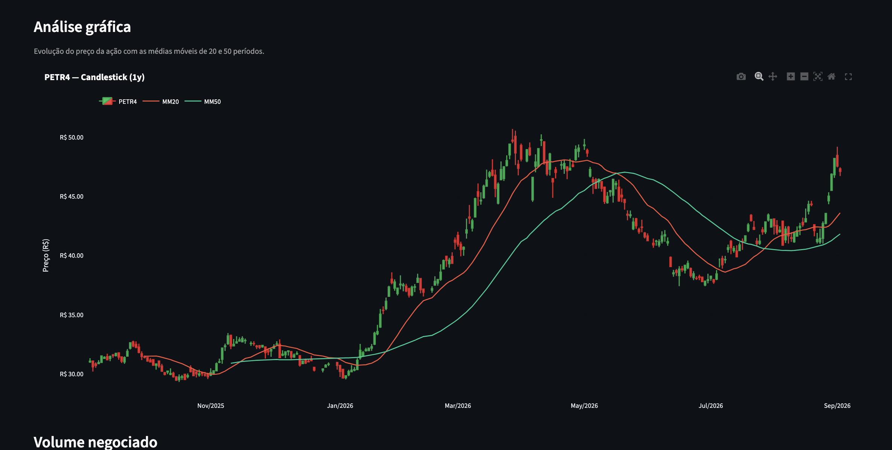

# B3 Insight

Dashboard interativo desenvolvido em **Python** para análise de ações negociadas na B3.

O projeto permite consultar dados históricos de ações brasileiras, visualizar indicadores de desempenho, analisar gráficos financeiros e comparar o desempenho do ativo com o Ibovespa.

🔗 **Aplicação online:** https://b3-insight.streamlit.app/

---

## Dashboard

Visão geral da aplicação com indicadores do período e informações da empresa.


---

## Análise gráfica

Visualização da evolução do preço por meio de gráfico **Candlestick**, acompanhado das médias móveis de 20 e 50 períodos (**MM20 e MM50**).



---

## Volume negociado

Visualização do volume de ações negociadas ao longo do período selecionado.


---

## Comparação com o Ibovespa

Comparação do desempenho da ação selecionada com o índice **Ibovespa**, utilizando séries normalizadas para facilitar a análise relativa.


---

## Funcionalidades

- Consulta de ações negociadas na B3
- Seleção de diferentes períodos de análise
- Indicadores de cotação, variação, máxima, mínima e volume
- Informações da empresa
- Gráfico Candlestick
- Médias móveis MM20 e MM50
- Análise de volume negociado
- Comparação de desempenho com o Ibovespa
- Visualização de dados históricos
- Exportação dos dados para CSV

---

## Tecnologias utilizadas

- Python
- Pandas
- Plotly
- Streamlit
- yfinance
- Git
- GitHub

---

## Estrutura do projeto

```text
B3-Insight/
├── dados/
├── imagens/
│   ├── dashboard.png
│   ├── candlestick.png
│   ├── volume.png
│   └── comparacao.png
├── src/
│   ├── app.py
│   ├── config.py
│   ├── dados.py
│   ├── graficos.py
│   └── indicadores.py
├── .gitignore
├── README.md
└── requirements.txt
```

---

## Como executar o projeto

Clone o repositório:

```bash
git clone https://github.com/nataliaferreira-DS/B3-Insight.git
```

Entre na pasta do projeto:

```bash
cd B3-Insight
```

Crie um ambiente virtual:

```bash
python3 -m venv .venv
```

Ative o ambiente virtual no macOS/Linux:

```bash
source .venv/bin/activate
```

Instale as dependências:

```bash
python -m pip install -r requirements.txt
```

Execute a aplicação:

```bash
python -m streamlit run src/app.py
```

---

## Dados

Os dados de mercado são obtidos através da biblioteca **yfinance**.

Os dados exibidos podem sofrer   atrasos ou alterações de acordo com a disponibilidade da fonte e são utilizados neste projeto para fins de estudo e análise.

---

## Objetivo do projeto

O **B3 Insight** foi desenvolvido como projeto de estudo e portfólio, aplicando conceitos de análise de dados, visualização de informações financeiras e desenvolvimento de dashboards interativos com Python.

---

## Autora

**Natalia Ferreira Do Nascimento**

[GitHub](https://github.com/nataliaferreira-DS)